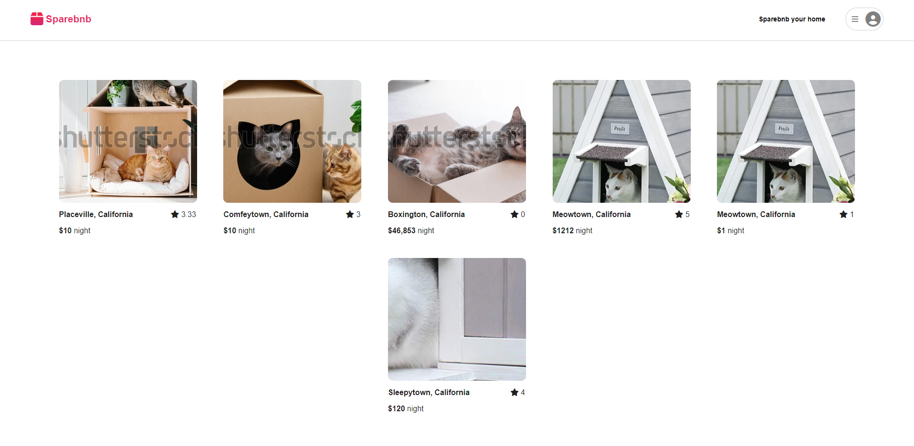
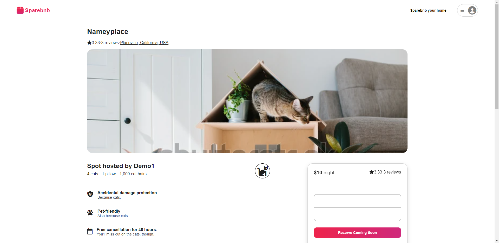
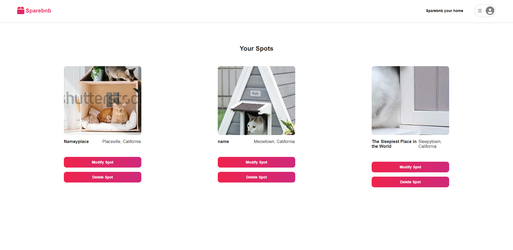
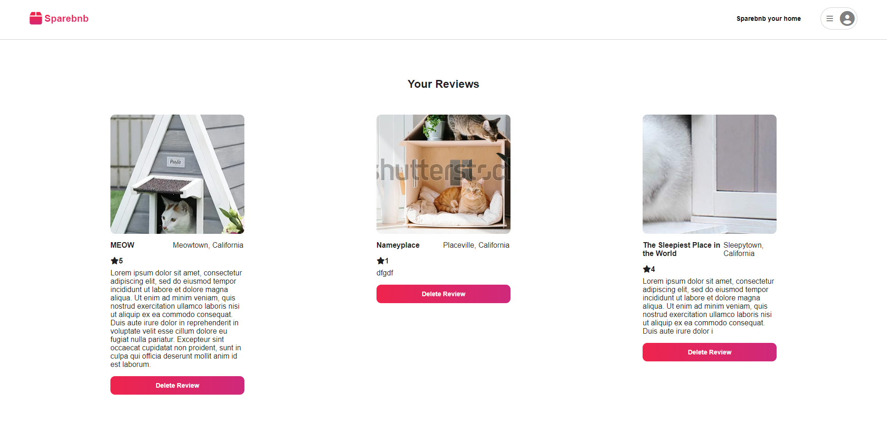

# Sparebnb

Live site: https://airbnb-clone-0h30.onrender.com/

Sparebnb is a website clone, inspired by Airbnb.com.
Features of Sparebnb include creating a user account, logging in and out of account, creating a spot page with details, loading all spots from database, displaying specific spots based ID, editing and deleting those spots, and creating, viewing, and deleting reviews for each spot.
Future feature plans include adding maps, additional image incorporation, and booking functionality

This project is built with JavaScript, Sequelize, Express, React, Redux, and Render.

## Home/Splash Page

## Detail Page for a Spot

## Manage Listings Page

## Manage User Reviews Page

To get started, clone the repo to your computer. Cd into the /backend folder, type 'npm start' and hit enter. Cd into the /frontend folder, type 'npm start' and hit enter. The project should be accessible on localhost:3000.

Contact at kirinagcaoili@gmail.com